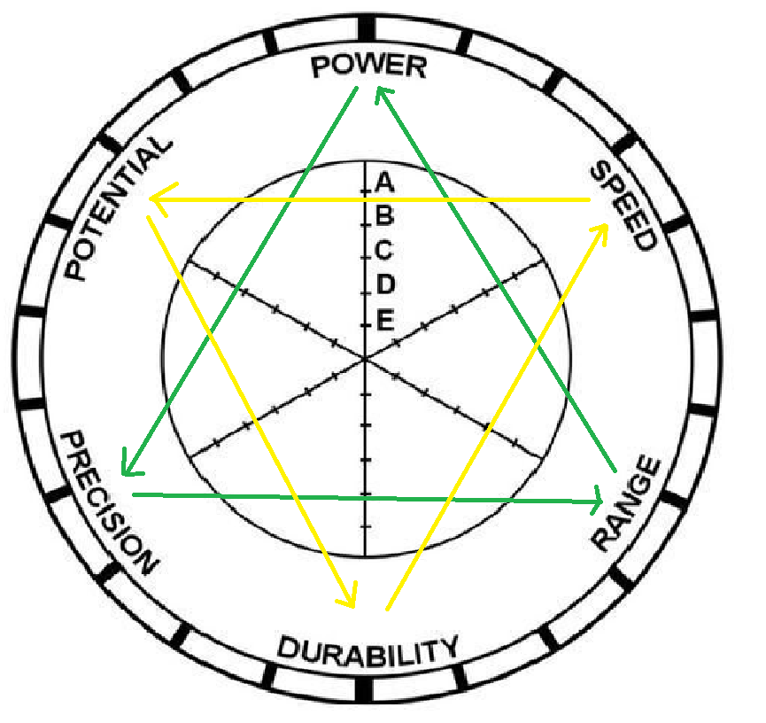

# JoJo flutter game
This is a game based on the JoJo's Bizarre Aventure universe. This is a two player game where each player has to choose a stand, and according to its attributes or stats, the winner will be one stand or another one.

The system how the winner is decided is by two like rock-paper-scissors triangles from the stats:
   
   - **Power** wins **Precision**, **Precision** wins **Range** and **Range** wins **Power**.
   - **Speed** wins **Potential**, **Potential** wins **Durability** and **Durability** wins **Speed**.

For every stand, the stat with the highest rank (A, B, C, D, E) in every triangle will be picked, and the stat in every triangle for both stands will be compared, and a victor will emerge for each triangle.

In case of a draw in the game, a random stat will be picked and compared between the two and the highest stat will decide the victor.

This is a university project made by Julià Mauri Costa, Marc Tarrés Urbieta & David Valdivia Martínez.
